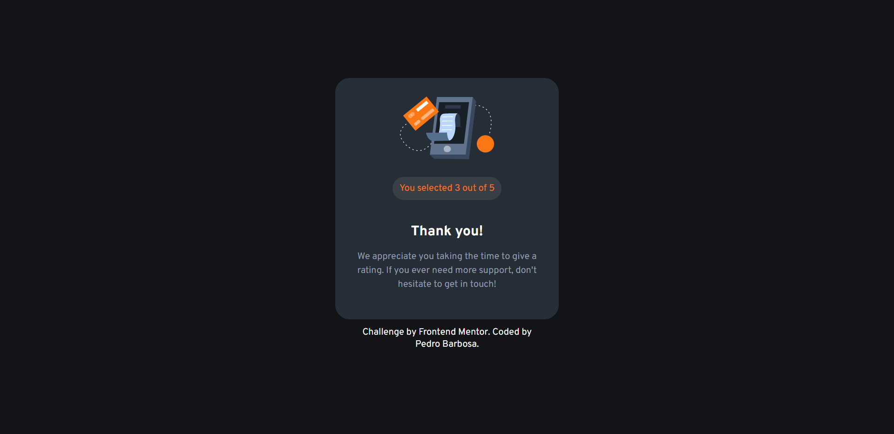

# Frontend Mentor - Interactive rating component solution

This is a solution to the [Interactive rating component challenge on Frontend Mentor](https://www.frontendmentor.io/challenges/interactive-rating-component-koxpeBUmI). Frontend Mentor challenges help you improve your coding skills by building realistic projects.

## Table of contents

- [Overview](#overview)
  - [The challenge](#the-challenge)
  - [Screenshot](#screenshot)
  - [Links](#links)
- [My process](#my-process)
  - [Built with](#built-with)
  - [What I learned](#what-i-learned)
  - [Continued development](#continued-development)
  - [Useful resources](#useful-resources)
- [Author](#author)

## Overview

### The challenge

Users should be able to:

- View the optimal layout for the app depending on their device's screen size
- See hover states for all interactive elements on the page
- Select and submit a number rating
- See the "Thank you" card state after submitting a rating

### Screenshots





### Links

- Solution URL: [https://github.com/pedrommb7/interactive-rating-component](https://github.com/pedrommb7/interactive-rating-component)
- Live Site URL: [https://fmratingcomponent.netlify.app/](https://fmratingcomponent.netlify.app/)

## My process

### Built with

- HTML
- SCSS, BEM
- Flexbox
- Atomic design
- Mobile-first workflow
- [React-TypeScript](https://create-react-app.dev/docs/adding-typescript/)

### What I learned

#### Lift state

Lifting state up to the parent component App and passing it down to other child component/s was a difficult concept to understand for me. After putting into practise what I saw on the React documentation, as well as a tutorial in there, I managed to understand.

```js
function App() {
  const [showThankyouCard, setShowThankyouCard] = useState(false);
  const [selectedRating, setSelectedRating] = useState(Number);

  const handleClick = () => {
    setShowThankyouCard(true);
  };

  const handleValue = (ratingValue: React.SetStateAction<number>) => {
    setSelectedRating(ratingValue);
  };

  return (
    <div className="App flex flex--column flex__align--center flex__justify--center">
      {showThankyouCard ? (
        <ThankyouCard rate={selectedRating} />
      ) : (
        <RatingCard onRating={handleValue} stateOfThankyouCard={handleClick} />
      )}
      <Footer className="my--12" />
    </div>
  );
}
```

### Continued development

- TypeScript
- React hooks

### Useful resources

- [Tic-Tac-Toe at React documentation](https://beta.reactjs.org/learn/tutorial-tic-tac-toe#lifting-state-up) - This Tic-Tac-Toe tutorial at React documentation helped me understand the concept of lifting state up to the parent component and passing it down to other component/s.

## Author

- Frontend Mentor - [@pedrommb7](https://www.frontendmentor.io/profile/pedrommb7)
